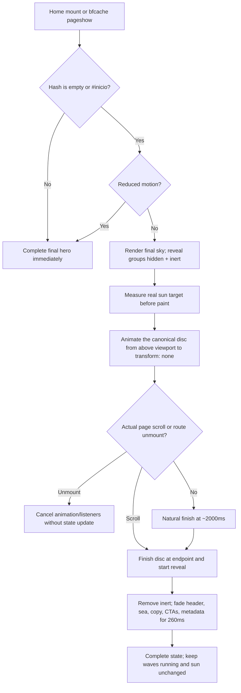

# Phase 10: Abertura cinematográfica do pôr do sol - Research

**Researched:** 2026-07-26
**Domain:** React SPA entry choreography, responsive DOM geometry, Web Animations API, navigation lifecycle, and accessibility
**Confidence:** HIGH for the codebase and architecture; MEDIUM for browser lifecycle details cited from current official documentation

<user_constraints>
## User Constraints (from CONTEXT.md)

### Locked Decisions

### Cena, trajetória e ritmo

- **D-01:** O primeiro frame mostra imediatamente apenas o céu do próprio
  hero em tela cheia, com o gradiente final estável. Não pode haver flash do
  hero completo antes da abertura.
- **D-02:** O sol começa totalmente fora da tela, entra pela borda superior e
  desce pelo eixo central até a posição real medida do sol do hero.
- **D-03:** O disco mantém exatamente o tamanho final e a mesma intensidade de
  halo durante todo o percurso. Céu, tamanho e halo não mudam durante a
  descida.
- **D-04:** A descida dura aproximadamente **2 segundos** e usa movimento
  cinematográfico suave: começa devagar, ganha velocidade e desacelera ao
  encaixar.
- **D-05:** A abertura não apresenta spinner, progresso, copy de espera ou
  qualquer estado que pareça loading.
- **D-06:** Ao pousar, o sol permanece continuamente visível e passa a ser o
  sol real do hero sem piscar, desaparecer ou reduzir opacidade.
- **D-07:** Mar, textos, CTAs, metadados e navegação surgem juntos em um fade
  curto de **250–300 ms**. As animações escalonadas atuais do hero são
  substituídas por esse único reveal.

### Frequência e navegação

- **D-08:** A abertura roda sempre que a rota `/` é carregada ou acessada
  novamente pelo hero. Não existe persistência de “já viu” em storage,
  cookie, sessão ou perfil.
- **D-09:** Rolar para baixo e voltar ao hero na mesma montagem não repete a
  abertura.
- **D-10:** Tocar no símbolo da topbar enquanto a pessoa já está na página
  apenas volta a `#inicio`; não reinicia a cena.
- **D-11:** Se a pessoa sair durante a animação e depois retornar à rota `/`,
  a abertura recomeça desde o início.
- **D-12:** Links diretos para outra seção, como `/#programacao`, respeitam o
  fragmento e não executam a abertura.

### Interação e acessibilidade

- **D-13:** Não existe botão “Pular”, gesto próprio ou controle específico da
  abertura.
- **D-14:** A camada visual não captura clique, toque ou teclado. A página
  continua tecnicamente navegável e rolável durante os 2 segundos.
- **D-15:** Uma rolagem iniciada durante a descida conclui imediatamente a
  abertura e libera a página no ponto escolhido pela pessoa.
- **D-16:** O skip link existente permanece como primeiro elemento focável,
  aparece acima da abertura ao receber foco e continua funcional.
- **D-17:** `prefers-reduced-motion: reduce` recebe o hero final
  imediatamente, sem descida e sem fade.

### Revelação do hero

- **D-18:** Links e botões ficam interativos assim que o fade de revelação
  começa; não esperam os 250–300 ms terminarem.
- **D-19:** O sol não participa do fade. Somente mar, conteúdo e navegação
  ganham opacidade ao redor do disco já encaixado.
- **D-20:** O mar aparece já em movimento durante o fade, sem uma etapa
  estática posterior.
- **D-21:** A composição inicial usa a própria linguagem visual do hero;
  nenhuma tela neutra ou escura antecede o céu.

### Decisões herdadas

- **D-22:** O alvo é a geometria realmente renderizada em cada viewport, não
  coordenadas duplicadas ou breakpoints paralelos.
- **D-23:** Resize ou mudança de orientação antes do início precisa produzir o
  alvo correto para 320 px, tablet e desktop.
- **D-24:** A cena reutiliza a arte e os tokens atuais do hero e preserva
  contraste AA, desempenho mobile, foco e a navegação existente.

### Claude's Discretion

- Técnica exata de medição e transição shared-element, desde que exista um
  único sol visual no encaixe e nenhum salto perceptível.
- Curva de easing concreta que materializa o ritmo decidido.
- Valor final dentro da faixa de 250–300 ms e tolerância de arredondamento
  subpixel.
- Limiar mínimo de rolagem que encerra a abertura, evitando cancelamento por
  ruído sem atrasar uma intenção real de navegação.
- Organização dos estados e testes, sem introduzir uma biblioteca pesada de
  animação por necessidade presumida.

### Deferred Ideas (OUT OF SCOPE)

None — discussion stayed within phase scope.
</user_constraints>

<phase_requirements>
## Phase Requirements

| ID | Description | Research Support |
|----|-------------|------------------|
| INTRO-01 | A entrada do site encena o sol se pondo e termina exatamente na geometria responsiva do sol real do hero, sem salto visual | Use one canonical visual sun inside a separately measurable target wrapper; measure its rendered `DOMRect`, animate only the inner disc's `transform`, and finish at the wrapper's zero transform. |
| INTRO-02 | A abertura preserva interação, desempenho mobile e acessibilidade, incluindo alternativa segura para `prefers-reduced-motion` | Keep the scene pointer-transparent, keep the skip link outside the inert groups, cancel on actual scroll, animate only `transform`/`opacity`, and initialize reduced-motion entries directly in the final state. |
</phase_requirements>

## Summary

The existing implementation already has every visual asset this phase needs: one responsive sun, the stable final sky gradient, three CSS/SVG wave bands, the hero copy, and a reactive reduced-motion store. It also has the important constraint that the topbar is a normal-flow sticky element before the hero, so the planner must deliberately let the home hero underlap that 72px chrome if the opening sky is to fill the viewport from the first row. `[VERIFIED: src/components/invite/Hero.tsx, src/components/invite/SeaWaves.tsx, src/components/layout/Shell.tsx, src/hooks/useReducedMotion.ts, src/index.css]`

The most reliable implementation is not a cloned shared-element overlay. Keep a target wrapper at the sun's existing responsive CSS geometry and put the only visual solar disc inside it. On an eligible mount, render the final sky synchronously, hide/inert only the reveal groups, measure the target wrapper before paint, and use `Element.animate()` to translate the inner disc from just above the viewport to `translateY(0)`. Because the endpoint is the element's normal style, finishing and canceling the animation leaves the exact same DOM disc at the exact responsive target; there is no clone swap to align. `getBoundingClientRect()` provides subpixel viewport-relative rendered geometry, and `useLayoutEffect` is React's pre-paint measurement hook. `[CITED: https://developer.mozilla.org/en-US/docs/Web/API/Element/getBoundingClientRect]` `[CITED: https://react.dev/reference/react/useLayoutEffect]`

Use a four-state coordinator—`descending`, `revealing`, `complete`, plus a run generation for bfcache re-entry—owned by `Home`. Eligibility is decided only by the hash present when that `Home` mount begins: empty hash and `#inicio` play; other fragments skip. Do not key replay from every `location` change, because same-page `#inicio` navigation must not restart. React Router exposes the current `Location`, including `hash` and `key`, but the project policy is mount-based, not location-key-based. `[CITED: https://reactrouter.com/api/hooks/useLocation]` `[CITED: https://api.reactrouter.com/v8/interfaces/react-router.Location.html]` `[VERIFIED: 10-CONTEXT.md D-08 through D-12]`

**Primary recommendation:** Add a small home-owned intro state machine and a WAAPI-powered canonical sun wrapper; use the existing `useReducedMotion`, existing CSS tokens, native `inert`, and the existing Playwright suite—no new runtime or test dependency.

## Architectural Responsibility Map

| Capability | Primary Tier | Secondary Tier | Rationale |
|------------|-------------|----------------|-----------|
| Entry eligibility and replay policy | Browser / Client | React Router | It depends on the current SPA mount, URL fragment, bfcache restoration, and no persistent server state. `[VERIFIED: 10-CONTEXT.md D-08 through D-12]` |
| Responsive sun target measurement | Browser / Client | CSS layout | The browser owns the final rendered geometry produced by `clamp()`, percentages, and media queries. `[VERIFIED: src/components/invite/Hero.tsx]` |
| Descent and reveal timing | Browser / Client | CSS compositor | WAAPI controls the measured translation; CSS controls the 260ms group opacity reveal. `[CITED: https://developer.mozilla.org/en-US/docs/Web/API/Element/animate]` |
| Reduced motion and focus safety | Browser / Client | HTML/CSS accessibility | `matchMedia`, `inert`, focus order, and the skip link are browser primitives. `[CITED: https://developer.mozilla.org/en-US/docs/Web/CSS/Reference/At-rules/%40media/prefers-reduced-motion]` `[CITED: https://developer.mozilla.org/en-US/docs/Web/HTML/Reference/Global_attributes/inert]` |
| Automated acceptance | Browser test | Unit test | Real geometry, focus, scrolling, animation lifecycle, and viewport changes require Playwright; pure eligibility helpers can use Vitest. `[VERIFIED: playwright.config.ts, vite.config.ts, tests/release.spec.ts]` |

## Standard Stack

No package installation is required. Versions below are the exact locally installed versions checked with `npm list --depth=0` on 2026-07-26. `[VERIFIED: npm list]`

### Core

| Library / API | Version | Purpose | Why Standard Here |
|---------------|---------|---------|-------------------|
| React | 19.2.8 | Home-owned state machine, refs, layout/effect lifecycle | Already owns the route composition; `useLayoutEffect` supports pre-paint geometry measurement and cleanup. `[VERIFIED: package.json, npm list]` `[CITED: https://react.dev/reference/react/useLayoutEffect]` |
| React Router | 7.18.1 | Current pathname/hash and SPA remount behavior | Already routes `/`, `/confirmar`, and `/presentes`; `useLocation` exposes the fragment without storage. `[VERIFIED: package.json, src/App.tsx]` `[CITED: https://reactrouter.com/api/hooks/useLocation]` |
| Web Animations API | Browser native | Measured transform animation with `finish()`/`cancel()` | It returns a controllable `Animation` and needs no animation library. `[CITED: https://developer.mozilla.org/en-US/docs/Web/API/Element/animate]` `[CITED: https://developer.mozilla.org/en-US/docs/Web/API/Animation]` |
| CSS / Tailwind v4 tokens | Existing project stack | Stable sky, reveal opacity, layout, z-index, motion media rules | The final art and motion tokens already live in `src/index.css`; the phase must reuse them. `[VERIFIED: src/index.css, DESIGN.md, 10-CONTEXT.md D-21/D-24]` |

### Supporting

| Library / API | Version | Purpose | When to Use |
|---------------|---------|---------|-------------|
| `useReducedMotion` | Project local | Reactive `prefers-reduced-motion` snapshot | Read synchronously during initial home render and complete immediately when `reduce` is active or becomes active. `[VERIFIED: src/hooks/useReducedMotion.ts]` |
| HTML `inert` | Browser native | Remove visually hidden header/hero actions from click, focus, tab order, and accessibility tree | Apply only while `descending`; remove at the first frame of `revealing`. `[CITED: https://developer.mozilla.org/en-US/docs/Web/HTML/Reference/Global_attributes/inert]` |
| Playwright Test | 1.62.0 | Deterministic cross-browser geometry, focus, scroll, hash, and reduced-motion tests | Use `addInitScript`, `emulateMedia`, `setViewportSize`, and programmatic WAAPI finish. `[VERIFIED: npm list, playwright.config.ts]` `[CITED: https://playwright.dev/docs/api/class-page]` |
| Vitest | 4.1.10 | Pure eligibility/threshold tests | Use only if the policy helpers are extracted from React; do not emulate layout in jsdom. `[VERIFIED: npm list, vite.config.ts]` |

### Alternatives Considered

| Instead of | Could Use | Tradeoff |
|------------|-----------|----------|
| Native WAAPI on the canonical disc | CSS keyframes with custom properties | CSS can animate the transform, but imperative `finish()` on scroll and deterministic access to lifecycle/progress become more awkward. The measured start offset still requires JavaScript. |
| One target wrapper + one visual disc | Clone/overlay shared element | A clone can cover the topbar gap, but creates two DOM suns and a swap boundary—the exact risk INTRO-01 is intended to eliminate. |
| Existing APIs | GSAP, Framer Motion, or another animation dependency | Adds bundle and lifecycle surface for a single two-keyframe transform; no required behavior needs it. |

**Installation:** none.

## Architecture Patterns

### System Architecture Diagram



### Recommended Project Structure

```text
src/
├── routes/
│   └── Home.tsx                         # owns eligibility, phase, replay generation
├── components/
│   ├── invite/
│   │   └── Hero.tsx                     # measurable target + canonical visual disc + reveal groups
│   └── layout/
│       └── Shell.tsx                    # home-under-topbar layout and header reveal/inert
├── hooks/
│   ├── useReducedMotion.ts              # reuse unchanged unless tests expose a bug
│   └── useCinematicIntro.ts             # optional extraction of lifecycle coordinator
├── lib/
│   ├── cinematicIntro.ts                # optional pure eligibility/timing helpers
│   └── cinematicIntro.test.ts           # fast policy tests
├── index.css                            # phase selectors; remove old hero stagger
tests/
└── cinematic-intro.spec.ts              # real-browser acceptance
```

The hook/helper split is optional; the plan should extract only logic that is genuinely testable without layout. The geometry and WAAPI work should remain next to the hero ref rather than being abstracted into a general animation framework.

### Pattern 1: Synchronous eligibility, mount-scoped replay

**What:** Derive the first intro phase during the initial render from the current hash and the synchronous reduced-motion snapshot. Never render the full hero and then hide it in `useEffect`.

**Why:** React documents that a normal effect may run after paint, while `useLayoutEffect` is the pre-paint hook for visual measurement. More importantly, the hidden/revealed class must already be present in the first React commit to prevent a full-hero flash. `[CITED: https://react.dev/reference/react/useEffect]` `[CITED: https://react.dev/reference/react/useLayoutEffect]`

```typescript
// Source basis: React useState/useLayoutEffect and React Router useLocation docs.
type IntroPhase = 'descending' | 'revealing' | 'complete'

export function isEligibleHeroHash(hash: string) {
  return hash === '' || hash === '#inicio'
}

const location = useLocation()
const reducedMotion = useReducedMotion()
const [phase, setPhase] = useState<IntroPhase>(() =>
  isEligibleHeroHash(location.hash) && !reducedMotion
    ? 'descending'
    : 'complete',
)
```

Do not add `location.key` or every `location.hash` change as a replay trigger. A new `Home` mount after `/confirmar` or `/presentes` naturally creates a new run, while changing the existing mounted home to `#inicio` does not. `[VERIFIED: src/App.tsx, src/routes/Home.tsx, 10-CONTEXT.md D-08 through D-12]`

### Pattern 2: Target wrapper plus canonical visual disc

**What:** Keep the responsive classes on a measurable wrapper and animate only its full-size child:

```tsx
<div
  ref={sunTargetRef}
  data-testid="hero-sun-target"
  className="absolute left-1/2 top-[62%] aspect-square w-[clamp(260px,28vw,480px)] -translate-x-1/2 -translate-y-1/2 sm:top-[59%]"
>
  <div
    ref={sunVisualRef}
    data-testid="hero-sun-visual"
    aria-hidden="true"
    className="h-full w-full rounded-full bg-sun"
  />
</div>
```

Measure `sunTargetRef.current.getBoundingClientRect()` only after the DOM commit. Use `-(rect.bottom + rect.height)` as the recommended initial Y translation: the extra full-disc diameter keeps both the disc and its existing 100px halo above the viewport instead of letting the blur glow into the first frame. Then animate the child to `translateY(0)`. The wrapper retains the current `clamp()` width and breakpoint top position, so the browser remains the only source of responsive geometry. `getBoundingClientRect()` returns floating-point rendered coordinates relative to the viewport and accounts for transforms. `[CITED: https://developer.mozilla.org/en-US/docs/Web/API/Element/getBoundingClientRect]` `[CITED: https://developer.mozilla.org/en-US/docs/Web/API/CSS_Object_Model/Determining_the_dimensions_of_elements]` `[VERIFIED: src/components/invite/Hero.tsx uses a 100px sun halo]`

Schedule the actual read in the first `requestAnimationFrame` created by the layout effect, not during render. Any resize/orientation change completed before that read is therefore reflected in the measured rect. A long-lived `ResizeObserver` is not required for this hero because the endpoint is always the live wrapper's zero transform; if implementation work reveals a second layout frame before start, observe only until the animation is created and disconnect immediately. The Resize Observer API is appropriate for element-size changes, but leaving it active and restarting a two-second intro on every notification would add unnecessary lifecycle and loop risk. `[CITED: https://developer.mozilla.org/en-US/docs/Web/API/Resize_Observer_API]`

Use only a translate transform for the 2000ms descent. Keep size, background, and box-shadow in static CSS. Use `cubic-bezier(.65, 0, .35, 1)` as the concrete ease-in/out recommendation: it supplies a slow departure, a faster middle, and a slow landing without an overshoot. At natural or forced completion, remove/cancel the finished animation only after the disc is at its base `transform: none`; the base style and endpoint are identical.

### Pattern 3: Symmetric animation cleanup under React Strict Mode

The project root is wrapped in `<StrictMode>`. React intentionally performs an extra development setup/cleanup cycle for effects and ref callbacks, so every animation, frame, timeout, and listener created by the intro must be canceled or removed by the same setup. `[VERIFIED: src/main.tsx]` `[CITED: https://react.dev/reference/react/StrictMode]`

```typescript
// Source basis: React useLayoutEffect and MDN Animation lifecycle docs.
useLayoutEffect(() => {
  if (phase !== 'descending') return

  let disposed = false
  let animation: Animation | undefined
  let frame = requestAnimationFrame(() => {
    const target = sunTargetRef.current
    const visual = sunVisualRef.current
    if (!target || !visual || disposed) {
      if (!disposed) onReveal()
      return
    }

    const rect = target.getBoundingClientRect()
    animation = visual.animate(
      [
        { transform: `translate3d(0, ${-(rect.bottom + rect.height)}px, 0)` },
        { transform: 'translate3d(0, 0, 0)' },
      ],
      {
        duration: 2000,
        easing: 'cubic-bezier(.65, 0, .35, 1)',
        fill: 'both',
      },
    )
    animation.onfinish = () => {
      if (!disposed) onReveal()
    }
  })

  return () => {
    disposed = true
    cancelAnimationFrame(frame)
    if (animation) {
      animation.onfinish = null
      animation.cancel()
    }
  }
}, [phase, runGeneration, onReveal])
```

`Animation.finish()` moves to the endpoint and fires `finish`; `Animation.cancel()` aborts and removes the effect. If the implementation uses `animation.finished` instead of `onfinish`, it must catch cancellation because the promise rejects when canceled. `[CITED: https://developer.mozilla.org/en-US/docs/Web/API/Web_Animations_API/Using_the_Web_Animations_API]`

### Pattern 4: Reveal groups, `inert`, and the skip link

Group only these elements behind the reveal state:

- Shell header/topbar and countdown rail.
- `SeaWaves`.
- Hero copy, CTAs, and corner metadata.

Do not include the sky, the canonical sun, the skip link, `<main>`, or later sections. The opening remains pointer-transparent because it is the existing hero background rather than an intercepting modal overlay. While descending, put `inert` on the hidden header and hidden hero-interaction wrapper and use `visibility: hidden; opacity: 0`. At `revealing`, remove `inert` immediately, set `visibility: visible`, and transition only opacity for the existing `--duration-medium` token (260ms). Native `inert` removes descendants from click, focus, tab order, and the accessibility tree. `[CITED: https://developer.mozilla.org/en-US/docs/Web/HTML/Reference/Global_attributes/inert]` `[VERIFIED: src/index.css defines --duration-medium: 260ms]`

The skip link is already before the header, becomes fixed on focus, and has `--z-skip: 110`, above the sticky header's `--z-sticky: 80`. Preserve that DOM order and do not place it inside an inert or opacity-hidden ancestor. `[VERIFIED: src/components/layout/Shell.tsx, src/index.css]`

The waves should remain mounted and animating behind opacity zero, then become visible during the reveal. That meets D-20 without adding a second start event. Under `prefers-reduced-motion`, the existing CSS already sets their animation to `none`; the intro phase must also initialize as `complete`, with no reveal transition. `[VERIFIED: src/components/invite/SeaWaves.tsx, src/index.css, src/hooks/useReducedMotion.ts]`

### Pattern 5: Make the sky truly fill the top of the viewport

`Shell` currently renders a 72px sticky header in normal flow before `<main>`, so the hero currently begins below that row. `[VERIFIED: src/components/layout/Shell.tsx]` For the home composition, add a Shell prop that lets `<main>` underlap exactly the topbar height (for example `-mt-[72px]`) while the header remains sticky and above it. This keeps the same scroll/sticky behavior, places the hero sky at viewport Y=0, and avoids toggling header positioning at reveal, which would move the measured target. The prop should be home-only; secondary routes should retain their current flow.

### Pattern 6: Scroll cancellation and fragment routing

Register one passive `scroll` listener only during `descending`. Capture `startScrollY` and complete when `Math.abs(window.scrollY - startScrollY) >= 4`; four CSS pixels is the recommended threshold because it ignores subpixel/no-op noise but reacts before a meaningful section navigation has progressed. Do not listen to `wheel` or `touchmove`: those can fire without an actual scroll at a boundary. On cancellation, call `animation.finish()` (or set the visual to its base transform), synchronously enter `revealing`, and leave the browser's scroll position untouched.

For non-hero initial fragments, initialize `complete` and run the project's established `getElementById(...).scrollIntoView(...)` style after the home DOM is committed. Do not build a dynamic CSS selector from `location.hash`; exact ID lookup avoids selector escaping and preserves the existing section `scroll-mt-32` offsets. `[VERIFIED: src/routes/Presentes.tsx uses getElementById + scrollIntoView; invite sections use scroll-mt-32]`

### Pattern 7: bfcache and route re-entry

Internal SPA route exits unmount `Home`, so returning creates a fresh eligible mount. A document restored from the browser back/forward cache may retain the completed or mid-animation React state; listen for `window.pageshow` and, when `event.persisted` is true and the current hash is eligible, increment a run generation and reset to `descending` (unless reduced motion is active). The `pageshow` event covers bfcache restoration and exposes `PageTransitionEvent.persisted`. `[CITED: https://developer.mozilla.org/en-US/docs/Web/API/Window/pageshow_event]`

Do not add an `unload` listener to manage this. It is unreliable and can harm bfcache eligibility; the intro only needs effect cleanup for SPA unmount and `pageshow` for restoration. `[CITED: https://web.dev/articles/bfcache]`

### Anti-Patterns to Avoid

- **Hide after `useEffect`:** can expose the complete hero for a paint before the intro state applies. Initialize the hidden phase during render.
- **Animate `top`, `left`, width, or height:** these affect layout or paint. Animate only the disc transform and reveal opacity. `[CITED: https://web.dev/articles/animations-guide]`
- **Clone the sun into a fixed overlay:** introduces an avoidable swap seam and duplicated responsive art.
- **Keep invisible controls focusable:** opacity alone leaves links in interaction order; use `inert` only on the hidden groups.
- **Replay on every `location.key` or `hash` update:** would violate the no-replay rule for the home wordmark.
- **Persist “already seen”:** explicitly conflicts with D-08.
- **Use `display: none` on the target:** there is no rendered target geometry to measure.
- **Use `animation.finished` without a rejection handler:** cancellation rejects the promise. `[CITED: https://developer.mozilla.org/en-US/docs/Web/API/Web_Animations_API/Using_the_Web_Animations_API]`
- **Leave the old `.hero-sky-enter`, `.hero-sun-enter`, and `.hero-enter--*` animations active:** they would create a second choreography and transform conflict after the new intro. `[VERIFIED: src/index.css lines 150–184 and 268–297]`

## Don't Hand-Roll

| Problem | Don't Build | Use Instead | Why |
|---------|-------------|-------------|-----|
| Animation scheduler | `setInterval`/per-frame React state loop | Native `Element.animate()` | Provides timing, finish, cancel, and compositor-compatible transform animation. `[CITED: https://developer.mozilla.org/en-US/docs/Web/API/Element/animate]` |
| Responsive coordinates | Parallel mobile/tablet/desktop numbers in TypeScript | Existing CSS geometry + `getBoundingClientRect()` | The browser already resolves `clamp()` and breakpoints to subpixel rendered geometry. `[VERIFIED: src/components/invite/Hero.tsx]` |
| Focus suppression | Manual `tabIndex` bookkeeping on every link | `inert` on the two hidden groups | Applies consistently to all current and future descendants. `[CITED: https://developer.mozilla.org/en-US/docs/Web/HTML/Reference/Global_attributes/inert]` |
| Reduced-motion listener | Another `matchMedia` store | Existing `useReducedMotion` | It already uses `useSyncExternalStore`, change events, legacy listener fallback, and cleanup. `[VERIFIED: src/hooks/useReducedMotion.ts]` |
| Scroll throttling framework | New utility/dependency | One temporary passive listener | The handler only compares two numbers and tears down after at most ~2s. |
| Shared-element library | Clone registry/portal framework | One target wrapper and one canonical disc | The phase has one element and one endpoint; a framework increases swap and cleanup risk. |

**Key insight:** the difficult part is lifecycle correctness, not interpolation. Native geometry, WAAPI, `inert`, and the existing motion store already cover the hard browser behavior.

## Common Pitfalls

### Pitfall 1: A cream strip or layout jump above the opening

**What goes wrong:** The “full-screen sky” starts below the 72px header, or the sun target moves when the header changes from normal flow to overlay.

**Why it happens:** The current sticky header occupies normal-flow space before `<main>`. `[VERIFIED: src/components/layout/Shell.tsx]`

**How to avoid:** Keep header positioning stable and underlap the home main/hero beneath it from the first render.

**Warning sign:** the measured target Y changes by about 72px at reveal.

### Pitfall 2: First-paint flash of copy or sea

**What goes wrong:** The complete hero appears briefly before being hidden.

**Why it happens:** Eligibility is applied in `useEffect`, after a browser paint is possible. `[CITED: https://react.dev/reference/react/useEffect]`

**How to avoid:** Initialize `phase` synchronously and include hidden/inert attributes in the first commit; use the layout effect only for geometry and animation startup.

**Warning sign:** a slowed-network or paused-WAAPI Playwright run captures title or waves before the sun starts.

### Pitfall 3: Double sun transform

**What goes wrong:** The sun lands above/below the target or scales during the descent.

**Why it happens:** The existing `.hero-sun-enter` keyframe also writes `transform`, while WAAPI writes another transform on the same element. `[VERIFIED: src/index.css hero-sun-settle]`

**How to avoid:** Remove the old hero entrance classes and separate wrapper positioning from inner-disc translation.

**Warning sign:** `getAnimations()` returns more than the intended intro animation for the visual disc.

### Pitfall 4: Strict Mode starts two animations

**What goes wrong:** Development shows duplicate finish callbacks, stale listeners, or state updates after unmount.

**Why it happens:** Strict Mode performs an additional development setup/cleanup cycle. `[CITED: https://react.dev/reference/react/StrictMode]`

**How to avoid:** Cancel the frame and animation, null callbacks, remove listeners, and guard completion with a disposed/idempotent flag.

**Warning sign:** one route entry logs two reveal transitions or scroll cancellation runs after leaving `/`.

### Pitfall 5: Invisible focus targets during descent

**What goes wrong:** Tab lands on an invisible header or hero CTA.

**Why it happens:** Opacity does not remove descendants from focus order.

**How to avoid:** Apply `inert` to only the hidden header and hero-interaction group; keep skip link/main/later content outside.

**Warning sign:** the active element is a CTA while its reveal group is still at opacity zero.

### Pitfall 6: Direct fragments replay or fail to scroll

**What goes wrong:** `/#programacao` plays the two-second opening at the top, or ends at the hero instead of the section.

**Why it happens:** Eligibility ignores the initial hash, or the SPA assumes a history update will perform native anchor scrolling.

**How to avoid:** Skip on every initial hash except empty/`#inicio`, then explicitly resolve the section with `getElementById` after commit.

**Warning sign:** `page.goto('/#programacao')` leaves `window.scrollY === 0`.

### Pitfall 7: Scroll cancellation leaves the sun mid-air

**What goes wrong:** Content reveals while the disc remains translated.

**Why it happens:** State changes without first finishing or canceling the WAAPI effect back to the base endpoint.

**How to avoid:** Use one idempotent `finishIntro()` that snaps the disc to endpoint, removes the active animation effect, and then enters `revealing`.

**Warning sign:** after scroll, visual and target rectangles differ by more than one CSS pixel.

### Pitfall 8: Reduced motion still fades

**What goes wrong:** The large descent is skipped but the 260ms reveal still runs.

**Why it happens:** Only the WAAPI start was gated; CSS transitions remain enabled.

**How to avoid:** Initial state is `complete`, and the reduced-motion CSS branch removes intro transitions as well as wave animation.

**Warning sign:** an emulated reduced-motion test observes any active animation on intro elements.

### Pitfall 9: bfcache restores a stale mid-animation frame

**What goes wrong:** Back navigation returns to a paused or already-completed opening even though it is a new entry.

**Why it happens:** bfcache restores the document and JavaScript heap rather than creating a new `Home` mount. `[CITED: https://developer.mozilla.org/en-US/docs/Web/API/Window/pageshow_event]`

**How to avoid:** Reset an eligible run on `pageshow.persisted`, with normal effect cleanup preserved.

**Warning sign:** a synthetic persisted `pageshow` event does not change the run generation.

### Pitfall 10: Existing release tests silently stop exercising navigation

**What goes wrong:** Role locators for the inert topbar return no active navigation during the first two seconds, so conditional `isVisible()` branches in `tests/release.spec.ts` skip their assertions.

**Why it happens:** The current keyboard test probes the menu immediately after navigation, while the new intro intentionally removes that menu from the active accessibility tree.

**How to avoid:** Before existing topbar/menu assertions, deterministically finish the intro or wait for `data-intro-phase="complete"`; keep the skip-link assertion before that wait so it still proves first-frame accessibility.

**Warning sign:** the release suite stays green even after deliberately breaking a nav href.

## Code Examples

### Idempotent completion

```typescript
// Source basis: MDN Animation finish/cancel lifecycle.
const finishIntro = () => {
  if (completedRef.current) return
  completedRef.current = true

  const animation = animationRef.current
  if (animation && animation.playState !== 'finished') {
    animation.finish()
  }
  animation?.cancel() // base transform is the same visual endpoint
  animationRef.current = null
  setPhase('revealing')
}
```

### Reduced-motion change during an active descent

```typescript
// Source basis: existing reactive useReducedMotion store.
useEffect(() => {
  if (reducedMotion && phase !== 'complete') {
    animationRef.current?.cancel()
    animationRef.current = null
    setPhase('complete')
  }
}, [reducedMotion, phase])
```

### bfcache replay

```typescript
// Source: https://developer.mozilla.org/en-US/docs/Web/API/Window/pageshow_event
useEffect(() => {
  const onPageShow = (event: PageTransitionEvent) => {
    if (
      event.persisted &&
      isEligibleHeroHash(window.location.hash) &&
      !reducedMotion
    ) {
      setRunGeneration((generation) => generation + 1)
      setPhase('descending')
    }
  }

  window.addEventListener('pageshow', onPageShow)
  return () => window.removeEventListener('pageshow', onPageShow)
}, [reducedMotion])
```

### Deterministic Playwright start/end control

```typescript
// Source basis: https://playwright.dev/docs/api/class-page
await page.addInitScript(() => {
  const originalAnimate = Element.prototype.animate
  Element.prototype.animate = function (...args) {
    const animation = originalAnimate.apply(this, args)
    if ((this as HTMLElement).dataset.testid === 'hero-sun-visual') {
      animation.pause()
      ;(window as Window & { __introAnimation?: Animation }).__introAnimation =
        animation
    }
    return animation
  }
})

await page.goto('/')
await expect(page.locator('[data-intro-phase="descending"]')).toBeAttached()

await page.evaluate(() => {
  ;(window as Window & { __introAnimation?: Animation }).__introAnimation?.finish()
})
```

`page.addInitScript` executes after document creation but before page scripts, so it can pause the intro at its first WAAPI frame without racing the app. Playwright can also emulate reduced motion and resize the viewport through official APIs. `[CITED: https://playwright.dev/docs/api/class-page]`

## State of the Art

| Old Approach | Current Approach | When / Support | Impact |
|--------------|------------------|----------------|--------|
| Manual `requestAnimationFrame` interpolation | Native `Element.animate()` with an `Animation` handle | Widely available across browsers since March 2020. `[CITED: https://developer.mozilla.org/en-US/docs/Web/API/Element/animate]` | Less per-frame application code and direct finish/cancel control. |
| Per-control focus suppression | Native `inert` on a subtree | Widely available since April 2023. `[CITED: https://developer.mozilla.org/en-US/docs/Web/HTML/Reference/Global_attributes/inert]` | Hidden groups are consistently removed from click, focus, tab order, and accessibility tree. |
| Integer layout dimensions | `getBoundingClientRect()` rendered floating-point geometry | Baseline across browsers; rects are viewport-relative and subpixel. `[CITED: https://developer.mozilla.org/en-US/docs/Web/API/Element/getBoundingClientRect]` | Tests should allow a ≤1 CSS-pixel tolerance, not demand integer equality. |
| Unmount-only re-entry assumptions | `pageshow.persisted` handling for bfcache | Baseline across browsers since July 2015. `[CITED: https://developer.mozilla.org/en-US/docs/Web/API/Window/pageshow_event]` | Route replay remains correct when the whole document is restored rather than remounted. |

**Deprecated/outdated for this phase:**

- The current `.hero-sky-enter`, `.hero-sun-enter`, and staggered `.hero-enter--*` choreography must be retired for the hero because D-07 replaces it with one reveal. `[VERIFIED: 10-CONTEXT.md D-07, src/index.css]`
- `unload` listeners should not be introduced for navigation cleanup; use React cleanup and `pageshow`/`pagehide` lifecycle where needed. `[CITED: https://web.dev/articles/bfcache]`

## Assumptions Log

All implementation-affecting claims in this research were verified in the codebase or cited from current official documentation. No `[ASSUMED]` claims remain.

## Open Questions (RESOLVED)

1. **Should direct `/#inicio` play?**
   - What we know: the locked policy says a new entry “pelo hero” plays, while same-mount wordmark navigation to `#inicio` does not. `[VERIFIED: 10-CONTEXT.md D-08/D-10]`
   - **RESOLVED:** Initial `/#inicio` is eligible; mount scope prevents the wordmark from replaying.

2. **Should an orientation change during the two-second descent restart the clock?**
   - What we know: the locked requirement explicitly demands correct geometry for resize/orientation before entry; the same wrapper/child endpoint remains correct even if CSS geometry changes during the animation. `[VERIFIED: 10-CONTEXT.md D-23]`
   - **RESOLVED:** Resize or orientation change does not restart the 2s clock. Re-read the target immediately before animation start; during descent let the responsive wrapper move naturally and verify the final child/wrapper rect equality after a test-time resize.

3. **What exact subpixel tolerance should gate INTRO-01?**
   - What we know: `getBoundingClientRect()` preserves fractional CSS-pixel geometry and the Playwright project includes DPR 2 mobile profiles. `[CITED: https://developer.mozilla.org/en-US/docs/Web/API/CSS_Object_Model/Determining_the_dimensions_of_elements]` `[VERIFIED: playwright.config.ts]`
   - **RESOLVED:** Geometry tolerance is ≤1 CSS px: compare center X, center Y, width, and height with absolute error ≤1 CSS pixel; also assert that the same visual node remains mounted across finish.

## Environment Availability

| Dependency | Required By | Available | Version | Fallback |
|------------|-------------|-----------|---------|----------|
| Node.js | Build, Vitest, Playwright | ✓ | 24.18.0 | — |
| npm | Existing scripts | ✓ | 12.0.1 | — |
| React / React DOM | Intro UI | ✓ | 19.2.8 | — |
| React Router | Entry/hash state | ✓ | 7.18.1 | — |
| Playwright Test | Browser validation | ✓ | 1.62.0 | — |
| Vitest | Pure policy tests | ✓ | 4.1.10 | — |

The existing unit suite passed on 2026-07-26: 31 files and 582 tests via `npm test`. `[VERIFIED: local command output]`

**Missing dependencies with no fallback:** none.

**Missing dependencies with fallback:** none.

## Validation Architecture

### Test Framework

| Property | Value |
|----------|-------|
| Framework | Playwright Test 1.62.0 for real browser behavior; Vitest 4.1.10 for pure helpers |
| Config file | `playwright.config.ts`; `vite.config.ts` |
| Quick run command | `npm run build && npx playwright test tests/cinematic-intro.spec.ts --project=emulated-chromium-desktop` |
| Full suite command | `npm run test:release` |

The configured matrix already covers Chromium and WebKit at desktop 1280×800 and mobile 320×760/DPR 2. A phase test should add an explicit tablet viewport (for example 768×1024) using `page.setViewportSize()` inside the geometry test. `[VERIFIED: playwright.config.ts]` `[CITED: https://playwright.dev/docs/api/class-page]`

### Phase Requirements → Test Map

| Req ID | Behavior | Test Type | Automated Command | File Exists? |
|--------|----------|-----------|-------------------|-------------|
| INTRO-01 | First committed intro state contains stable sky, hidden reveal groups, and disc outside the top edge | Playwright deterministic first-frame | `npm run build && npx playwright test tests/cinematic-intro.spec.ts --project=emulated-chromium-desktop -g "first frame"` | ❌ Wave 0 |
| INTRO-01 | The same sun visual finishes at the measured target within ≤1 CSS px at 320px, tablet, and desktop, including resize before finish | Playwright geometry | `npm run build && npx playwright test tests/cinematic-intro.spec.ts --project=emulated-chromium-desktop -g "geometry"` | ❌ Wave 0 |
| INTRO-01 | Duration is 2000ms, easing is the chosen curve, halo/size remain static, and old hero animations are absent | Playwright computed timing/style | `npm run build && npx playwright test tests/cinematic-intro.spec.ts --project=emulated-chromium-desktop -g "timing"` | ❌ Wave 0 |
| INTRO-02 | Reduced motion shows final hero immediately with no intro animation or fade | Playwright media emulation | `npm run build && npx playwright test tests/cinematic-intro.spec.ts --project=emulated-chromium-desktop -g "reduced motion"` | ❌ Wave 0; partial coverage exists in `tests/release.spec.ts` |
| INTRO-02 | Actual scroll ≥ threshold finishes the sun, starts reveal, and preserves scroll position | Playwright interaction | `npm run build && npx playwright test tests/cinematic-intro.spec.ts --project=emulated-chromium-desktop -g "scroll cancellation"` | ❌ Wave 0 |
| INTRO-02 | Skip link remains first focus target and above the scene; hidden header/hero controls are inert until reveal | Playwright keyboard/accessibility | `npm run build && npx playwright test tests/cinematic-intro.spec.ts --project=emulated-chromium-desktop -g "skip link"` | ❌ Wave 0; baseline skip coverage exists in `tests/release.spec.ts` |
| INTRO-02 | New eligible route mount replays; same-mount `#inicio` does not; direct section fragment skips and scrolls | Playwright navigation | `npm run build && npx playwright test tests/cinematic-intro.spec.ts --project=emulated-chromium-desktop -g "route entry"` | ❌ Wave 0 |
| INTRO-02 | Persisted `pageshow` resets an eligible run; unmount leaves no active callback/listener | Playwright lifecycle + synthetic event | `npm run build && npx playwright test tests/cinematic-intro.spec.ts --project=emulated-chromium-desktop -g "bfcache"` | ❌ Wave 0 |
| INTRO-02 | Eligibility and 4px scroll threshold policy | Vitest unit | `npx vitest run src/lib/cinematicIntro.test.ts` | ❌ Wave 0 if helper is extracted |

### Determinism Strategy

1. Install one `page.addInitScript()` before navigation that wraps only `Element.prototype.animate` calls on `[data-testid="hero-sun-visual"]`, pauses the returned animation at time zero, and stores its handle. The API guarantees the init script runs before app scripts. `[CITED: https://playwright.dev/docs/api/class-page]`
2. Assert initial state/rects while paused; inspect `animation.effect?.getTiming()` for duration and easing.
3. Call `animation.finish()` rather than waiting two wall-clock seconds for most tests.
4. Compare target and visual `boundingBox()` values in CSS pixels with ≤1px tolerance. Playwright locator coordinates use viewport-relative CSS pixels, matching `getBoundingClientRect()`. `[CITED: https://playwright.dev/docs/api/class-locator]`
5. Keep one unpatched smoke test that waits for natural completion, proving the real timer path; do not make every matrix case pay the 2s delay.
6. Avoid screenshot assertions as the primary geometry oracle: Playwright disables/fast-forwards finite CSS and Web Animations by default for screenshots, which would erase the start-state timing under test. `[CITED: https://playwright.dev/docs/api/class-locatorassertions]`

### Sampling Rate

- **Per task commit:** `npx vitest run src/lib/cinematicIntro.test.ts` when the helper exists, plus the focused desktop Playwright grep for the behavior changed.
- **Per wave merge:** `npm run build && npx playwright test tests/cinematic-intro.spec.ts`
- **Phase gate:** `npm run test:release` green before `/gsd-verify-work`.

### Wave 0 Gaps

- [ ] `src/lib/cinematicIntro.test.ts` — eligibility, initial state, and scroll-threshold policy if pure helpers are extracted.
- [ ] `tests/cinematic-intro.spec.ts` — deterministic first-frame, geometry, resize, reduced motion, focus, scroll, fragment, re-entry, and bfcache coverage for INTRO-01/02.
- [ ] `tests/release.spec.ts` — retain the first-frame skip-link check, then finish/wait for the intro before existing topbar and mobile-menu assertions so inert content does not silently bypass them.
- [ ] Add stable intro phase and target/visual selectors (`data-intro-phase`, `data-testid`) solely as observable contracts; do not test internal React state.
- Existing framework/config is sufficient; no package or config install is needed. `[VERIFIED: vite.config.ts, playwright.config.ts, package.json]`

## Security Domain

`security_enforcement` is enabled at ASVS level 1. This phase adds no network request, secret, persistent data, authentication boundary, or backend mutation. `[VERIFIED: .planning/config.json, phase scope]`

### Applicable ASVS Categories

| ASVS Category | Applies | Standard Control |
|---------------|---------|-----------------|
| V2 Authentication | No | No identity or session behavior changes. |
| V3 Session Management | No | The no-persistence decision explicitly forbids cookie/session/storage state for the intro. |
| V4 Access Control | No | Public presentation behavior only. |
| V5 Input Validation | Limited | Treat `location.hash` as untrusted text; compare against the exact hero allowlist and use `getElementById` for known section IDs, never HTML or selector interpolation. |
| V6 Cryptography | No | No cryptographic operation or secret. |

### Known Threat Patterns for This Stack

| Pattern | STRIDE | Standard Mitigation |
|---------|--------|---------------------|
| URL fragment interpolated into a selector or HTML | Tampering | Exact eligibility comparison; map to stable `SECTION_IDS`; use `document.getElementById`. |
| Invisible interactive controls receiving input | Spoofing / usability safety | `inert` on hidden header and hero controls; pointer-transparent scene; skip link remains outside. |
| Leaked animation/listener after route exit | Denial of Service / reliability | Symmetric Strict Mode cleanup of RAF, Animation, timers, scroll, `pageshow`, and media subscriptions. |

## Sources

### Primary: codebase (HIGH confidence)

- `10-CONTEXT.md` — locked phase behavior and discretion.
- `.planning/REQUIREMENTS.md` and `.planning/ROADMAP.md` — INTRO-01/02 and success criteria.
- `src/components/invite/Hero.tsx` — current responsive target, sky, sun, and reveal groups.
- `src/components/invite/SeaWaves.tsx` and `src/index.css` — wave lifecycle, tokens, old hero entrance, and reduced motion.
- `src/components/layout/Shell.tsx` — 72px sticky topbar, skip-link order/z-index, and current scroll listener.
- `src/routes/Home.tsx`, `src/App.tsx`, `src/main.tsx` — composition, route remount boundaries, and Strict Mode.
- `src/hooks/useReducedMotion.ts` — current reactive media-query store.
- `playwright.config.ts`, `tests/release.spec.ts`, `vite.config.ts`, `package.json` — validation stack and matrix.

### Official documentation (MEDIUM confidence)

- https://react.dev/reference/react/useLayoutEffect — pre-paint measurement and cleanup.
- https://react.dev/reference/react/useEffect — paint timing and flicker guidance.
- https://react.dev/reference/react/StrictMode — development setup/cleanup stress cycle.
- https://reactrouter.com/api/hooks/useLocation — current Location hook.
- https://api.reactrouter.com/v8/interfaces/react-router.Location.html — hash/key fields.
- https://developer.mozilla.org/en-US/docs/Web/API/Element/getBoundingClientRect — rendered viewport geometry.
- https://developer.mozilla.org/en-US/docs/Web/API/Resize_Observer_API — element-size observation and lifecycle.
- https://developer.mozilla.org/en-US/docs/Web/API/Element/animate — native animation creation.
- https://developer.mozilla.org/en-US/docs/Web/API/Animation — finish/cancel controls.
- https://developer.mozilla.org/en-US/docs/Web/API/Web_Animations_API/Using_the_Web_Animations_API — callbacks and canceled `finished` promise.
- https://developer.mozilla.org/en-US/docs/Web/HTML/Reference/Global_attributes/inert — focus/click/accessibility suppression.
- https://developer.mozilla.org/en-US/docs/Web/CSS/Reference/At-rules/%40media/prefers-reduced-motion — reduced-motion semantics.
- https://developer.mozilla.org/en-US/docs/Web/API/Window/pageshow_event — bfcache restoration signal.
- https://web.dev/articles/bfcache — lifecycle guidance and avoiding `unload`.
- https://web.dev/articles/animations-guide — transform/opacity performance guidance.
- https://playwright.dev/docs/api/class-page — init scripts, media emulation, and viewport resizing.
- https://playwright.dev/docs/api/class-locator — CSS-pixel geometry.
- https://playwright.dev/docs/api/class-locatorassertions — screenshot animation behavior.

### Tertiary (LOW confidence)

- None.

## Metadata

**Confidence breakdown:**

- Standard stack: HIGH — all recommended runtime/test dependencies already exist at exact local versions; no new package is proposed.
- Architecture: HIGH — based on inspected component boundaries and native APIs whose behavior is cited from official docs.
- Navigation/bfcache details: MEDIUM — official browser/router documentation is current, but real bfcache restoration remains browser-policy-dependent and should retain a manual smoke in addition to the synthetic automated event.
- Pitfalls: HIGH — most are direct conflicts visible in current source (`hero-sun-enter`, sticky header flow, Strict Mode, skip-link z-index) or documented lifecycle behavior.

**Research date:** 2026-07-26
**Valid until:** 2026-08-25 for the stable browser APIs and pinned project versions; re-check if React Router, Playwright, or the hero layout changes before implementation.
